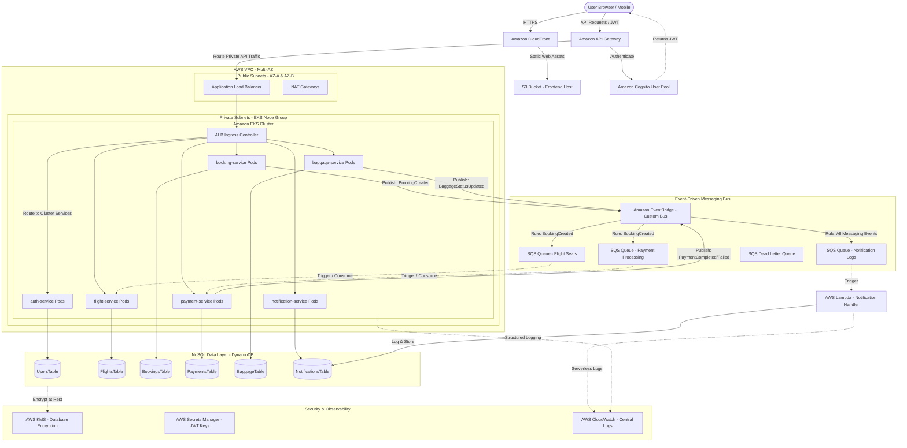

# AeroLink Airline Systems Platform: Architecture and Technical Plan

This document outlines the system architecture, design decisions, data flows, and AWS integrations for the **AeroLink Airline Systems Platform**, satisfying all requirements for the university assignment prototype.

---

## 1. Executive Summary & Design Goals
AeroLink is transitioning from a legacy monolithic application to a cloud-native, distributed microservices-based web platform. The platform is designed with the following operational and architectural goals:
*   **High Availability & Fault Tolerance:** Multi-AZ container deployments on Amazon EKS with auto-healing, load balancing via ALB, and automatic database backups.
*   **Global Scalability:** Serverless database capabilities via Amazon DynamoDB, autoscaling of containers using Horizontal Pod Autoscaler (HPA), and content delivery via Amazon CloudFront.
*   **Real-time & Decoupled Communication:** Event-driven architecture utilizing Amazon EventBridge, Amazon SQS, and AWS Lambda to orchestrate asynchronous tasks like baggage status changes, seat inventory adjustments, and passenger notifications.
*   **Enterprise-grade Security:** Identity management via Amazon Cognito, JSON Web Tokens (JWT), role-based access control (RBAC), data encryption at rest (AWS KMS), and secure secrets storage (AWS Secrets Manager).

---

## 2. Cloud Architecture Reference Diagram

### Physical and Logical Network Layout (Mermaid)



---

## 3. Detailed Component Breakdown (AWS Services Mapping)

Here is a breakdown of why each cloud service is used, and how it maps to our implementation strategy:

| AWS Service | Architectural Role / Purpose | Assignment Requirement Addressed |
| :--- | :--- | :--- |
| **Amazon VPC** | Multi-AZ isolated virtual network with public subnets for load balancing and private subnets for core microservices and data. | Cloud-Based Architecture, Security |
| **Amazon EKS (Kubernetes)** | Container orchestration platform running the 6 microservices as secure, scalable Pods. Managed Node Groups automatically scale. | High Availability, Global Scalability, EKS Recovery |
| **AWS Fargate / Node Groups** | Executes EKS container workloads without managing physical servers, ensuring auto-healing of pods. | Fault Tolerance & Pod Recovery |
| **Application Load Balancer (ALB)** | Distributes incoming HTTP/HTTPS traffic across EKS node targets across multiple Availability Zones. | Load Balancing, Multi-AZ Deployment |
| **Amazon API Gateway** | Public-facing entry point. Handles request routing, rate limiting, and acts as the Cognito User Pool Authorizer. | Secure API Design, Load Balancing |
| **Amazon Cognito** | Secure identity provider. Manages user pools, user sign-up/sign-in, and groups (`PASSENGER`, `STAFF`, `ADMIN`). | Identity & Access Management, JWT/Cognito Auth |
| **Amazon DynamoDB** | Serverless NoSQL database hosting 6 partition-key based tables with global scale, point-in-time recovery, and zero server management. | Database Design, High Availability, PITR |
| **Amazon EventBridge** | Serverless event bus acting as the central nervous system for decoupled microservice communication. | Event-Driven Architecture, Real-Time Sync |
| **Amazon SQS** | Point-to-point queues absorbing transaction spikes, decoupling services, and queuing work asynchronously. | Asynchronous Decoupling, Fault Tolerance |
| **SQS Dead Letter Queues (DLQs)** | Catches and stores failed events after maximum retries for manual debugging or inspection. | Fault Tolerance & Resilience |
| **AWS Lambda** | Asynchronously processes messages from the Notification SQS queue, writing execution histories to the Notifications Table. | Serverless, Asynchronous Event Processing |
| **AWS KMS** | Customer Managed Keys (CMK) encrypting sensitive configuration data in Secrets Manager and DynamoDB tables at rest. | Security & Compliance, Encryption at Rest |
| **AWS Secrets Manager** | Securely stores JWT secret keys, Third-Party Payment Credentials, and Database variables, avoiding plaintext storage in code. | Security, Secrets Management |
| **AWS CloudWatch** | Aggregates application logs, custom business metrics, and execution graphs. | Monitoring & Observability |
| **S3 + CloudFront** | S3 hosts the compiled React.js production bundle. CloudFront serves it globally via edge locations with HTTPS protection. | Frontend Hosting, Global Scalability |

---

## 4. End-to-End Core Workflow: Passenger Booking & Async Operations

### The Transaction Flow Sequence
```
Passenger                              Booking-Service                        EventBridge                           Flight-Service               Payment-Service             Lambda / Notifications
    |                                        |                                     |                                      |                            |                        |
    |---- 1. POST /bookings ---------------->|                                     |                                      |                            |                        |
    |                                        |---- 2. Create Booking (PENDING) --->|                                      |                            |                        |
    |                                        |---- 3. Publish BookingCreated ----->|                                      |                            |                        |
    |<--- 4. Return Booking ID (201) --------|                                     |                                      |                            |                        |
    |                                        |                                     |---- 5. Route to Flight SQS --------->|                            |                        |
    |                                        |                                     |---- 6. Route to Payment SQS ------------------------------------->|                        |
    |                                        |                                     |---- 7. Route to Notification SQS --------------------------------------------------------->|
    |                                        |                                     |                                      |                            |                        |
    |                                        |                                     |                                      |-- 8. Reduce Seats -------->|                        |
    |                                        |                                     |                                      |    (DynamoDB Write)        |                        |
    |                                        |                                     |                                      |                            |                        |
    |                                        |                                     |                                      |                            |-- 9. Process Payment ->|
    |                                        |                                     |                                      |                            |   (Stripe Dummy)       |
    |                                        |                                     |                                      |                            |-- 10. Publish Event -->|
    |                                        |                                     |                                      |                            |    (PaymentCompleted)  |
    |                                        |                                     |                                      |                            |                        |
    |                                        |                                     |<--- 11. Route PaymentCompleted Event |                            |                        |
    |                                        |<------------------------------------|                                      |                            |                        |
    |                                        |                                                                            |                            |                        |
    |                                        |-- 12. Update Booking Status --------|                                      |                            |                        |
    |                                        |    (SUCCESS)                        |                                      |                            |                        |
    |                                        |                                     |                                      |                            |                        |
    |                                        |                                     |                                      |                            |                        |-- 13. Write Log ------> [NotificationsTable]
    |                                        |                                     |                                      |                            |                        |   "Payment Receipt"
```

1.  **Request Initiation:** The Passenger client issues a `POST /bookings` request to the API Gateway with booking criteria (flight ID, passenger ID, seat count).
2.  **Booking Placement:** The `booking-service` saves a transaction record into the DynamoDB `BookingsTable` with status `PENDING`.
3.  **Event Ingestion:** The `booking-service` immediately fires a `BookingCreated` payload into Amazon EventBridge and returns a `201 Created` receipt payload to the browser.
4.  **Decoupled Fan-Out:** EventBridge evaluates three rules:
    *   **Rule A (Seats):** Routes the event payload to `SQS-Flight-Seats-Queue`.
    *   **Rule B (Payments):** Routes the event payload to `SQS-Payment-Gateway-Queue`.
    *   **Rule C (Communications):** Routes the event payload to `SQS-Notification-Queue`.
5.  **Seat Reduction:** The `flight-service` consumes the event from `SQS-Flight-Seats-Queue` and executes an atomic conditional update on DynamoDB (`available_seats = available_seats - booked_seats` if `available_seats >= booked_seats`).
6.  **Payment Processing:** The `payment-service` consumes the event from `SQS-Payment-Gateway-Queue`, runs a secure tokenized charge workflow, registers a transaction inside the `PaymentsTable`, and publishes a `PaymentCompleted` event back to the bus.
7.  **Status Propagation:** The `booking-service` reacts to `PaymentCompleted` by upgrading the booking status to `PAID` (or `FAILED` if payment failed).
8.  **Serverless Notification:** The serverless AWS Lambda triggers on the `Notification SQS` queue, generates an email-styled notification payload, and logs the execution to the DynamoDB `NotificationsTable` with a CloudWatch trace link.

---

## 5. Mapping University Assignment Requirements to Architectural Components

| Assignment Requirements | Implementation Vector | Location / Evidence Source |
| :--- | :--- | :--- |
| **1. Cloud-Based Architecture** | Designed with 100% AWS native services provisioned via multi-file structured Terraform modules. | `infrastructure/terraform/` |
| **2. Distributed Web App & API** | 6 containerized FastAPI microservices documented via interactive Swagger/OpenAPI dashboards and a unified React.js client. | `services/`, `frontend/` |
| **3. Security, Compliance, & Consistency** | Password hashing (bcrypt), Cognito authentication, JWT route guards, RBAC roles (`PASSENGER`, `STAFF`, `ADMIN`), AWS KMS encryption at rest, and AWS Secrets Manager for variables. | `services/auth-service/`, `infrastructure/terraform/modules/kms/` |
| **4. Real-Time Data Synchronization** | EventBridge custom event bus linking Booking placement with asynchronous flight-service seat decrements, payment state changes, and staff baggage operations. | `services/flight-service/`, `services/baggage-service/` |
| **5. Fault Tolerance & Resilience** | SQS Queues acting as buffers, SQS Dead-Letter Queues (DLQ) for message isolation, EKS container pod replica sets across 2 Availability Zones, and auto-healing. | `infrastructure/kubernetes/hpa.yaml`, `infrastructure/terraform/modules/sqs/` |
| **6. Performance & Scalability** | Horizontal Pod Autoscaler (HPA) policies based on CPU utilization and custom Load Testing scripts. | `tests/performance/k6-booking-test.js` |
| **7. Monitoring & Observability** | Structured JSON logs using Python's native logging format, custom endpoint `/health` for each service, and CloudWatch metrics mappings. | FastAPI files under `services/`, `docs/cloudwatch.md` |
| **8. Testing Strategy** | Unit tests via `pytest` for backend calculations, Swagger-based active endpoints testing, and fully complete Postman API collections. | `tests/unit/`, `postman/` |
| **9. Deployment & Orchestration** | Docker files for container builds, Kubernetes configuration files, GitOps Argo CD pipeline description, and a complete GitHub Actions CI/CD configuration. | `docker-compose.yml`, `infrastructure/kubernetes/`, `infrastructure/github-actions/` |

---

## 6. Database Design Schema Details

### `UsersTable`
*   **Hash/Partition Key:** `user_id` (String - UUID)
*   **Attributes:** `name` (String), `email` (String, Indexed via GSI), `password_hash` (String), `role` (String: PASSENGER, STAFF, ADMIN), `created_at` (String - ISO8601)

### `FlightsTable`
*   **Hash/Partition Key:** `flight_id` (String - UUID)
*   **Attributes:** `flight_number` (String), `origin` (String), `destination` (String), `departure_time` (String), `arrival_time` (String), `price` (Number), `total_seats` (Number), `available_seats` (Number), `status` (String: SCHEDULED, DELAYED, DEPARTED, CANCELLED)

### `BookingsTable`
*   **Hash/Partition Key:** `booking_id` (String - UUID)
*   **Attributes:** `passenger_id` (String - UUID, GSI), `flight_id` (String - UUID), `seat_count` (Number), `booking_status` (String: PENDING, SUCCESS, FAILED), `payment_status` (String: UNPAID, PAID, REFUNDED), `created_at` (String - ISO8601)

### `PaymentsTable`
*   **Hash/Partition Key:** `payment_id` (String - UUID)
*   **Attributes:** `booking_id` (String - UUID, GSI), `amount` (Number), `payment_status` (String: PENDING, SUCCEEDED, FAILED), `payment_method` (String), `transaction_reference` (String), `created_at` (String - ISO8601)

### `BaggageTable`
*   **Hash/Partition Key:** `baggage_id` (String - UUID)
*   **Attributes:** `booking_id` (String - UUID, GSI), `passenger_id` (String - UUID), `current_status` (String: CHECKED_IN, SORTING, IN_TRANSIT, ARRIVED, CLAIMED), `last_updated` (String - ISO8601), `location` (String)

### `NotificationsTable`
*   **Hash/Partition Key:** `notification_id` (String - UUID)
*   **Attributes:** `user_id` (String - UUID, GSI), `event_type` (String), `message` (String), `created_at` (String - ISO8601)

---

## 7. Draw.io Style Architectural Layout & Visual Logic

To conceptualize the layout visually in a whiteboard format (Draw.io block style), the platform is segmented into four distinct architectural swimlanes:

```
+-----------------------------------------------------------------------------------------------------------------------------------------------------------------+
|                                                        SWIMLANE 1: EDGE & IDENTITY MANAGEMENT (AWS PUBLIC NETWORKS)                                            |
|                                                                                                                                                                 |
|  [Client Browser] ==========> (HTTPS via CDN) ==========> [S3 Static Frontend / CloudFront Edge]                                                                |
|         ||                                                                                                                                                      |
|         || API Requests (Bearer JWT Header)                                                                                                                     |
|         \/                                                                                                                                                      |
|  [AWS API Gateway] ---------- (Validation Sync Handshake) -----------> [Amazon Cognito User Pool]                                                               |
+-----------------------------------------------------------------------------------------------------------------------------------------------------------------+
|                                                        SWIMLANE 2: LOGICAL ORCHESTRATION (AWS PRIVATE VPC SUBNETS)                                              |
|                                                                                                                                                                 |
|                                       +=================== [Application Load Balancer (ALB)] ===================+                                       |
|                                       ||                                                                       ||                                       |
|                                       \/                                                                       \/                                       |
|                              [auth-svc Pods]                                                         [flight-svc Pods]                                  |
|                                       ||                                                                       ||                                       |
|                                       \/                                                                       \/                                       |
|                             [booking-svc Pods]                                                       [payment-svc Pods]                                 |
|                                       ||                                                                       ||                                       |
|                                       \/                                                                       \/                                       |
|                             [baggage-svc Pods]                                                    [notification-svc Pods]                               |
+-----------------------------------------------------------------------------------------------------------------------------------------------------------------+
|                                                        SWIMLANE 3: ASYNCHRONOUS EVENT ROUTING & DECOUPLING                                                      |
|                                                                                                                                                                 |
|   (Asynchronous Publish)                                                                                                                                        |
|   [booking-svc] --------------> [Amazon EventBridge (Custom Bus)]                                                                                               |
|                                         ||                                                                                                                      |
|                                         ||===> [Rule: Seats] =======> [SQS Flight Seats Queue] ========> [flight-svc]                                           |
|                                         ||===> [Rule: Charge] ======> [SQS Payment Gateway Queue] =====> [payment-svc]                                          |
|                                         ||===> [Rule: Logger] ======> [SQS Notification Logs Queue] =====> [AWS Lambda Worker]                                  |
+-----------------------------------------------------------------------------------------------------------------------------------------------------------------+
|                                                        SWIMLANE 4: DATA INTEGRITY & COMPLIANCE LAYER                                                            |
|                                                                                                                                                                 |
|   [UsersTable]            [FlightsTable]            [BookingsTable]            [PaymentsTable]            [BaggageTable]            [NotificationsTable]         |
|         \\                      //                        \\                         //                         \\                         //               |
|          ================================================== [AWS KMS Key Managed Decryption] ==================================================          |
+-----------------------------------------------------------------------------------------------------------------------------------------------------------------+
```

This ensures complete horizontal separation: Edge delivery, core computation pods within secure Kubernetes networks, asynchronous pub/sub messaging channels, and isolated serverless tables.
